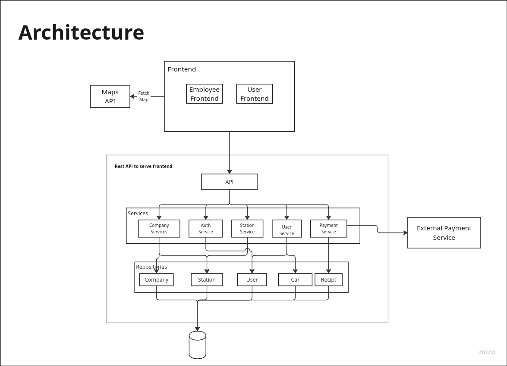
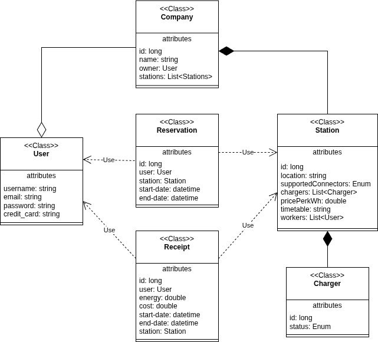
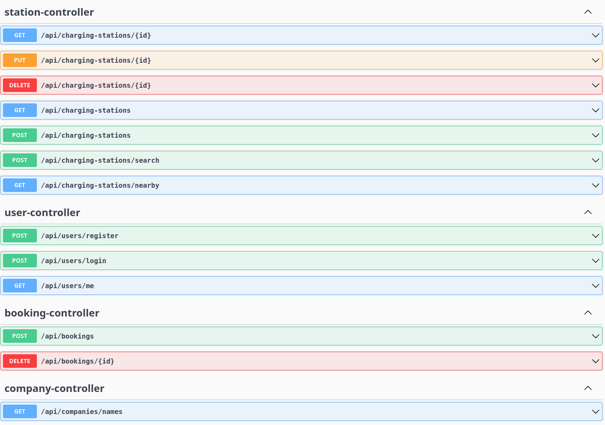

# PowerNest

## Abstract
A PowerNest oferece às pessoas uma forma rápida e fácil de carregar os seus carros elétricos, permitindo bookings antecipados das estações de carregamento, gestão dos bookings e até flexibilidade na procura de estações disponíveis para uso imediato.

## Alterações após a apresentação
### Testes de integração com cucumber
### ...

## Equipa
* **Product Owner​**: 113682​ - Gabriel Santos
* **QA Engineer**: 113893​ - Guilherme Santos
* **Arquiteto**: 114514​ - João Gaspar
* **Team coordinator**: 115697 - Shelton Agostinho

## Arquitetura


## Modelos da base de dados e Diagrama de Classes
*Modelos de base de dados*


*Diagrama de classes*



## Documentação da API
A documentação da API pode ser acessada em [http://deti-tqs-09.ua.pt:8080/swagger-ui/index.html](http://deti-tqs-09.ua.pt:8080/swagger-ui/index.html), se estiver na rede da UA, ou em [http://localhost:8080/swagger-ui/index.html](http://localhost:8080/swagger-ui/index.html) se puser a funcionar localmente.

* *screenshot*


## Executar o projeto
### Aceder ao ambiente de produção
A nossa aplicação está disponível em [http://deti-tqs-09.ua.pt/](http://deti-tqs-09.ua.pt/)
*(Acessível apenas através da rede UA ou via VPN)*

### Pôr a funcionar localmente
*Clone do projecto*
```bash
$ git clone git@github.com:GCapaross/TQS-Group-Project.git
```
*Entrar na raiz do projecto*
```bash
$ cd TQS-Group-Project
```
*Verificar o ficheiro .env que deverá estar disponível. Por fim:*
```bash
$ docker compose up -d --build
```
*Poderá acessar a página em [localhost:5173/](http://localhost:5173/)*