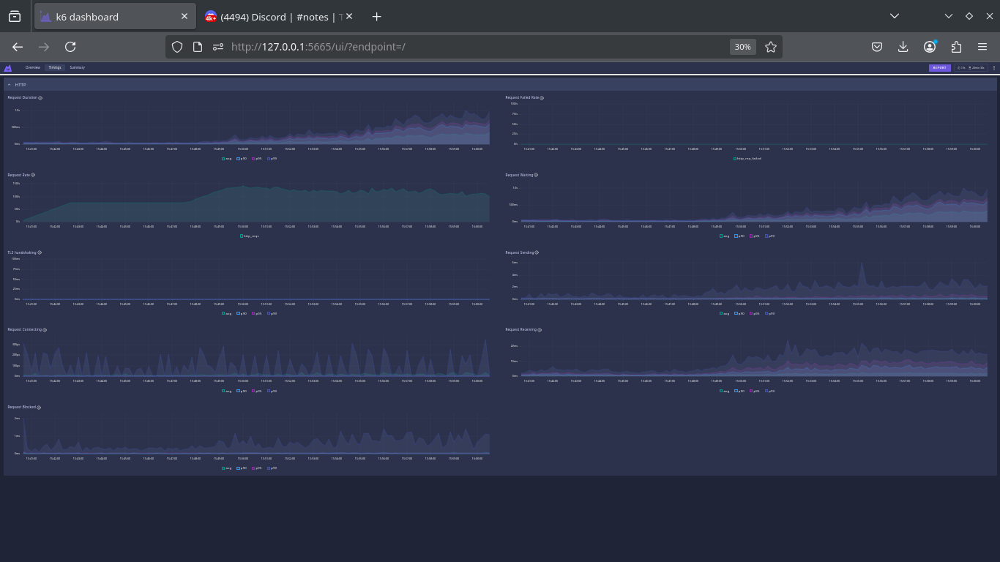

# PowerNest

## Abstract
PowerNest offers people a fast and easy way to charge their electric cars, allowing them to make advance reservations for charging stations, manage those reservations, and even enjoy the flexibility of finding stations available for immediate use.

## Changes after presentation
* ### Integration tests with cucumber
* ### Functional continuous delivery
* ### Load tests
* ### Xray setup completion
* ### Compose health status
* ### API documentation
* ### Product Specification Report
* ### Quality Manual
* ### Continuation and development of more frontend tests
* ### Report updated
* ### Workload tests
* ### Corrected deployment
* ### New sequence diagrams
* ### Actuator
* ### Health status
* ### Grafana dashboard upgrade

## The Team
* **Product Owner​**: 113682​ - Gabriel Santos
* **QA Engineer**: 113893​ - Guilherme Santos
* **Architecture**: 114514​ - João Gaspar
* **Team coordinator**: 115697 - Shelton Agostinho

## Architecture Diagram


## Database Models and Class Diagram

*Database Models*


*Class Diagram*


## API Documentation

The API documentation can be accessed at [http://deti-tqs-09.ua.pt:8080/swagger-ui/index.html](http://deti-tqs-09.ua.pt:8080/swagger-ui/index.html) if you are on the UA network, or at [http://localhost:8080/swagger-ui/index.html](http://localhost:8080/swagger-ui/index.html) if you run it locally.

---

*Screenshot*


## Running the Project
### Accessing the Production Environment
Our application is available at [http://deti-tqs-09.ua.pt/](http://deti-tqs-09.ua.pt/)  
*(Accessible only through the UA network or via VPN)*

### Running Locally
*Clone the project*
```bash
$ git clone git@github.com:GCapaross/TQS-Group-Project.git
```
*Change to the project root*
```bash
$ cd TQS-Group-Project
```
*Ensure the .env file is present, then:*
```bash
$ docker compose up -d --build
```
*You can access the site at [localhost:5173/](http://localhost:5173/)*


# Regarding some of the changes made from thursday to monday (after presentation)

## Continuation and development of more frontend tests
Regarding this part we completed and added more cucumber tests imeplemented together with XRAY.


## Workload tests
Workload tests were done with prometheus and k6 for the logins, the registers, and also for the booking service and booking a reservation, tested with 400+ VU's, and 20 minutes of overloading requests. There was a logic error in the booking reservation due to not being able to have overlapping bookings, but it was corrected and also the objective was just to see how the server would handle, so gladly they fail if overbooked (they don't fail anymore, the logic tracks the year, in case we run the test again).




## Corrected deployment
The deployment was just a clone, but now we corrected the runner and setup of secrets that we were having errros on the presentation day.
Grafana, Nagios, the tests, and any other variables and ports were corrected according to the deployment.


## New sequence diagrams


## Actuator
## Health status

Actuator	Exposes endpoints for monitoring (e.g., /actuator/health)
Health status	Indicates if the app and its dependencies are running correctly

For example when running docker, some services don't appear just running but appear "healthy"


## Grafana dashboard upgrade
Was better implemented and exported the configuration to the deployment.


Booking requests, some default spring parameters, registers, etc...
The api requests and counts are made, just having a problem of no data when deploying
